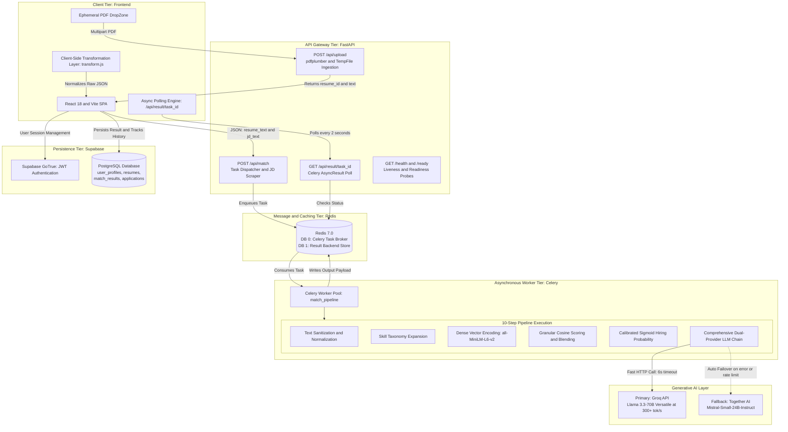

# SkillGap AI 🎯
### *Autonomous Semantic Job Matching, Skill Gap Intelligence & Career Acceleration Platform*

[](https://fastapi.tiangolo.com)
[](https://reactjs.org/)
[](https://docs.celeryq.dev/)
[](https://redis.io/)
[](https://huggingface.co/sentence-transformers/all-MiniLM-L6-v2)
[](https://groq.com/)
[](https://supabase.com/)
[](https://opensource.org/licenses/MIT)

---

## 📖 Overview

**SkillGap AI** is a full-stack, production-grade AI platform that helps job seekers stop applying blindly. Traditional Applicant Tracking Systems (ATS) and job platforms rely on rigid keyword matching, rejecting qualified candidates for minor syntax differences (e.g., *"Kubernetes"* vs. *"K8s"*). Meanwhile, generic chatbot prompts produce arbitrary, uncalibrated scores with frequent hallucinations.

SkillGap AI bridges this divide by decoupling **deterministic mathematical evaluation** from **constrained generative intelligence**:
1. **Mathematical Semantic Engine:** Converts resumes and job descriptions into 384-dimensional dense vectors using **Sentence-Transformers** (`all-MiniLM-L6-v2`), evaluates cosine similarities across granular components (skills, projects, experience), and calculates an industry-calibrated hiring probability via custom **Sigmoid transformations**.
2. **Generative Career Intelligence:** Employs an ultra-fast **Groq** (Llama 3.3-70B) LPU pipeline with automatic failover to **Together AI** (Mistral-Small-24B). In a single consolidated API call, it rewrites resume bullets with quantified impact, identifies critical missing skills, and synthesizes a structured 30-60-90 day learning roadmap.
3. **Privacy-First Ephemeral Architecture:** Ingests and parses PDF resumes in memory with immediate deletion, guaranteeing zero persistent storage of candidate PDFs for strict privacy and GDPR compliance.

---

## ⚡ What SkillGap AI Does

* **Semantic Fit Beyond Keywords:** Evaluates the contextual meaning of candidate achievements rather than checking for exact string frequency.
* **Two-Stage Skill Matching:** Performs exact lexical matching followed by semantic cosine similarity matching (similarity threshold $\ge 0.60$) to detect synonyms and related technologies.
* **Calibrated Hiring Probability:** Re-scales raw vector distances through a domain-aware Sigmoid calibration curve adjusted for candidate seniority, keyword density, and experience gaps.
* **Quantified Resume Bullet Rewrites:** Rephrases experience bullet points using action-oriented verbs and JD-specific terminology without fabricating factual claims or metrics.
* **Actionable 30-60-90 Day Roadmap:** Delivers targeted, sprint-based learning milestones categorized into Critical, Important, and Nice-to-Have competencies.
* **Alternate Job Title Recommendations:** Discovers adjacent roles where the candidate's existing skill set boasts a higher immediate success rate.
* **End-to-End Application Tracker:** Includes a Supabase-backed workspace to monitor job applications, interview stages, and historical match trajectory over time.

---

## 🏗️ System Architecture



---

## 🔄 End-to-End Pipeline: From First Step to Last Step

Below is the complete execution flow of an analysis from the moment a user uploads a resume to the rendered output:

```
[Candidate] Drops Resume PDF & Pastes Job Description
  │
  ├─► STEP 1: Ephemeral Upload & Ingestion (Frontend -> FastAPI)
  │   • React DropZone validates file type (.pdf) and size (<= 10MB).
  │   • Sends multipart/form-data to POST /api/upload.
  │   • FastAPI writes stream to a temporary file via tempfile.NamedTemporaryFile.
  │   • pdfplumber extracts page text and computes confidence heuristics.
  │   • The finally block immediately triggers tmp_path.unlink() (Zero persistent PDF footprint).
  │   • Returns { resume_id, extracted_text, extraction_confidence } to client.
  │
  ├─► STEP 2: Match Task Submission (Frontend -> FastAPI)
  │   • User clicks "Analyze Match".
  │   • Frontend issues POST /api/match with resume text, JD text (or JD URL), and user metadata.
  │   • If a URL is supplied, the scraper extracts clean job description text using BeautifulSoup.
  │   • FastAPI generates a unique task_id (UUID4), enqueues match_pipeline.apply_async(),
  │     and immediately returns HTTP 202 Accepted { task_id, status: 'pending' }.
  │
  ├─► STEP 3: Asynchronous Worker Pickup (Redis -> Celery Worker)
  │   • Celery worker running in solo pool mode pulls task from Redis DB 0.
  │   • Worker dynamically imports NLP and ML dependencies, isolating CPU load from web threads.
  │
  ├─► STEP 4: Text Normalization & Skill Taxonomy Expansion
  │   • clean_text() strips non-alphanumeric noise, normalizes unicode, and collapses whitespace.
  │   • Regex and domain vocabularies extract candidate technical skills.
  │   • ai/skill_expansion_cleaned.json maps high-level skills to granular sub-competencies
  │     (e.g., "Generative AI" expands to include "Tokenization", "Direct Preference Optimization").
  │
  ├─► STEP 5: Dense Semantic Embeddings (Sentence-Transformers)
  │   • EmbedderSingleton loads all-MiniLM-L6-v2 (384-dimensional dense vectors).
  │   • Generates 5 separate embeddings:
  │     1) Resume Overall Text Vector
  │     2) Job Description Overall Text Vector
  │     3) Resume Technical Skills Vector
  │     4) Job Description Required Skills Vector
  │     5) Target Role & Domain Vector
  │
  ├─► STEP 6: Multi-Component Granular Cosine Scoring
  │   • Computes component cosine scores:
  │     - Skill Match Score = cosine(Resume Skills, JD Skills)
  │     - Project Relevance = cosine(Resume Projects, JD Role)
  │     - Experience Relevance = cosine(Resume Experience, JD Role)
  │   • Calculates Weighted Score: (0.60 * Skills) + (0.20 * Projects) + (0.20 * Experience).
  │   • Additive Context Blending: Blends 70% weighted granular score with 30% overall context cosine
  │     to ensure candidate skills aren't penalized by unrelated resume background text.
  │
  ├─► STEP 7: Two-Stage Hybrid Skill Gap Analysis
  │   • Stage 1 (Exact Match): Checks direct normalized string inclusion.
  │   • Stage 2 (Semantic Fallback): Unmatched JD skills evaluated against resume skills using cosine similarity.
  │     Matches with cosine >= 0.60 are marked as found (e.g., "PostgreSQL" <-> "Postgres DB").
  │   • Unmatched skills categorized by priority:
  │     - Critical (frequency >= 2 in JD)
  │     - Important (frequency >= 1 in JD)
  │     - Nice-to-Have (supporting skills)
  │
  ├─► STEP 8: Calibrated Sigmoid Hiring Probability
  │   • Base Probability: base_prob = sigmoid(final_score * 10 - 2.5) * 100.
  │   • Zero-gap safety: If missing skills == 0, base probability is floored at 85%.
  │   • Domain adjustments applied: Tech (1.0), Finance (0.92), Healthcare (0.88).
  │   • Seniority adjustments applied: +10% for overqualified candidates, -15% for junior vs senior JDs.
  │   • Exact keyword boost added (up to +5%) and experience shortfall penalty deducted (0.07 per year gap).
  │   • Clamped between 1% and 99%.
  │
  ├─► STEP 9: Dual-Provider Comprehensive LLM Analysis
  │   • Single unified API call to Groq (Llama 3.3-70B Versatile) with 6-second timeout.
  │   • If Groq fails or rate-limits (HTTP 429), automatically fails over to Together AI (Mistral-Small-24B).
  │   • Strictly validates JSON output containing:
  │     - strengths & weaknesses
  │     - 3 rewritten resume bullet points (with quantified metrics & action verbs)
  │     - 30-60-90 day progressive learning roadmap
  │     - alternate job title recommendations
  │
  └─► STEP 10: Compilation, Polling & Client Presentation
      • Celery worker writes completed payload to Redis DB 1.
      • Client polling GET /api/result/{task_id} receives completed payload.
      • Frontend transformation layer (transform.js) parses raw data into display sentences.
      • React updates state and renders match scores, skill breakdown, roadmaps, and rewrites.
      • Stored permanently in Supabase PostgreSQL (match_results table) under user's profile.
```

---

## 💻 How Frontend and Backend Work

### Frontend Architecture (`/frontend`)
* **Framework & Build:** React 18, Vite, Vanilla CSS design system (Glassmorphism, custom CSS variables, responsive panels).
* **State Management:** React state hooks (`useState`, `useEffect`, `useDeferredValue`, `useRef`) managing authentication sessions, live analyses, and historical archives.
* **Component Hierarchy:**
  * `App.jsx`: Root controller managing authentication state, tab navigation, active analyses, and Supabase data synchronization.
  * `DropZone.jsx`: Accessible drag-and-drop zone with client-side file size and MIME-type validation.
  * `ScoreGauge.jsx`: Animated SVG radial gauge displaying calibrated hiring probability.
  * `ResultDetail.jsx`: Comprehensive match report displaying granular scores, missing skill chips (Critical, Important, Nice-to-Have), and side-by-side bullet comparisons.
  * `RoadmapTimeline.jsx`: 30-60-90 day milestone tracker with external resource links.
  * `DashboardTabs.jsx`: Tab switcher for Analysis Lab, Match Archive, Application Tracker, and Profile.
* **Transformation Layer (`frontend/src/lib/transform.js`):**
  * Decouples raw API arrays from display formatting.
  * Converts skill lists into natural English sentences.
  * Normalizes roadmap JSON and prepares search URLs for LinkedIn and Google Jobs.

### Backend Architecture (`/backend`)
* **Framework:** FastAPI running on Uvicorn with asynchronous event loops.
* **API Routers:**
  * `routers/upload.py`: Handles multipart PDF uploads, temporary file extraction via `pdfplumber`, confidence calculations, and cleanup.
  * `routers/match.py`: Enqueues Celery jobs, checks async status, and fetches completed analysis payloads from Redis.
  * `routers/health.py`: Liveness (`/health`) and readiness (`/ready`) endpoints verifying Redis connectivity.
* **Task Worker (`fastapi_app/worker.py`):**
  * Celery application with `solo` worker pool for Windows compatibility and predictable resource isolation.
  * Implements `CallbackTask` with exponential retry backoff on unexpected network glitches.
* **Machine Learning Services (`fastapi_app/ml`):**
  * `embedder.py`: Thread-safe Singleton loader for `SentenceTransformer('all-MiniLM-L6-v2')`.
  * `matcher.py`: Exact and semantic two-stage skill matcher.
  * `scorer.py`: Granular weighting, additive blending, and Sigmoid hiring probability calibration.
* **LLM Service Layer (`fastapi_app/services/llm_service.py`):**
  * Centralized provider registry managing **Groq** (Primary) and **Together AI** (Fallback).
  * Strict temperature control ($T=0.3$) and JSON schema enforcement.

---

## 📐 Mathematical Formulations

### 1. Vector Cosine Similarity
Evaluates the directional alignment between two $n$-dimensional dense vectors:

$$\text{Cosine Similarity}(A, B) = \frac{A \cdot B}{\|A\| \|B\|} = \frac{\sum_{i=1}^{n} A_i B_i}{\sqrt{\sum_{i=1}^{n} A_i^2} \sqrt{\sum_{i=1}^{n} B_i^2}}$$

### 2. Multi-Component Granular Weighting
Calculates individual semantic alignments between document sections:

$$\text{Score}_{\text{weighted}} = 0.60 \cdot \text{Cosine}(\text{Skills}) + 0.20 \cdot \text{Cosine}(\text{Projects}) + 0.20 \cdot \text{Cosine}(\text{Experience})$$

### 3. Additive Context Blending
Protects candidates from having high technical qualifications penalized by generic resume background text:

$$\text{Final Match Score} = (0.70 \times \text{Score}_{\text{weighted}}) + (0.30 \times \text{Cosine}_{\text{overall}})$$

### 4. Calibrated Sigmoid Hiring Probability
Transforms raw scores into an intuitive, discriminative hiring probability curve:

$$\text{Base Probability} = \frac{100}{1 + e^{-(10 \times \text{Score}_{\text{final}} - 2.5)}}$$

$$\text{Hiring Probability} = \text{clamp}\Big((\text{Base Prob} \times F_{\text{domain}} \times F_{\text{seniority}}) + \text{Bonus}_{\text{keyword}} - \text{Penalty}_{\text{exp}}, \; 1, \; 99\Big)$$

*Where $F_{\text{domain}} \in [0.88, 1.0]$, $F_{\text{seniority}} \in [0.85, 1.10]$, $\text{Bonus}_{\text{keyword}} \le 0.05$, and $\text{Penalty}_{\text{exp}} = \Delta_{\text{years}} \times 0.07$.*

---

## 🗄️ Database Schema (Supabase PostgreSQL)

```sql
-- Core User Profiles (Linked with Supabase GoTrue Auth)
CREATE TABLE public.user_profiles (
    id UUID PRIMARY KEY REFERENCES auth.users(id),
    email TEXT UNIQUE,
    full_name TEXT,
    profile_picture_url TEXT,
    bio TEXT,
    created_at TIMESTAMP DEFAULT CURRENT_TIMESTAMP
);

-- Uploaded Resume References
CREATE TABLE public.resumes (
    id UUID PRIMARY KEY DEFAULT uuid_generate_v4(),
    user_id UUID NOT NULL REFERENCES public.user_profiles(id) ON DELETE CASCADE,
    filename TEXT NOT NULL,
    extraction_confidence FLOAT,
    extracted_text TEXT,
    raw_sections JSONB,
    created_at TIMESTAMP DEFAULT CURRENT_TIMESTAMP
);

-- Comprehensive Match Analysis Results
CREATE TABLE public.match_results (
    id UUID PRIMARY KEY DEFAULT uuid_generate_v4(),
    user_id UUID NOT NULL REFERENCES public.user_profiles(id) ON DELETE CASCADE,
    resume_id UUID NOT NULL REFERENCES public.resumes(id) ON DELETE CASCADE,
    jd_role TEXT,
    jd_text TEXT NOT NULL,
    match_score FLOAT NOT NULL,
    hiring_probability INT NOT NULL,
    cosine_similarity FLOAT NOT NULL,
    granular_scores JSONB,
    score_factors JSONB,
    matched_skills TEXT[],
    missing_skills TEXT[],
    critical_missing TEXT[],
    rewritten_bullets JSONB,
    roadmap JSONB,
    recommended_roles JSONB,
    created_at TIMESTAMP DEFAULT CURRENT_TIMESTAMP
);

-- Application Tracker Kanban
CREATE TABLE public.applications (
    id UUID PRIMARY KEY DEFAULT uuid_generate_v4(),
    user_id UUID NOT NULL REFERENCES public.user_profiles(id) ON DELETE CASCADE,
    match_result_id UUID REFERENCES public.match_results(id) ON DELETE SET NULL,
    company TEXT NOT NULL,
    role TEXT NOT NULL,
    status TEXT DEFAULT 'Applied' CHECK (status IN ('Applied', 'Interview', 'Offer', 'Rejected', 'Withdrawn')),
    applied_date DATE,
    match_score FLOAT,
    notes TEXT,
    created_at TIMESTAMP DEFAULT CURRENT_TIMESTAMP
);
```

---

## 🗂️ Repository Layout

```text
SkillGap-AI/
├── ai/                                # Machine Learning & MLOps Pipeline
│   ├── dvc.yaml                      # DVC 4-stage pipeline definitions
│   ├── params.yaml                   # Centralized ML configuration & thresholds
│   ├── skill_expansion_cleaned.json  # Skill taxonomy knowledge graph
│   └── src/
│       ├── data/                     # Text sanitization & preprocessing
│       ├── features/                 # Dense vector feature engineering
│       ├── model/                    # Cosine distance, evaluation & sigmoid math
│       └── logger/                   # Structured logging configuration
├── backend/                           # FastAPI Application & Services
│   ├── Dockerfile.api                # Container definition for web API
│   ├── Dockerfile.worker             # Container definition for Celery worker
│   ├── deployment.yaml               # Kubernetes (EKS) manifests + HPA
│   ├── requirements.txt              # Production Python dependencies
│   ├── supabase/                     # PostgreSQL database schema & migrations
│   └── fastapi_app/
│       ├── main.py                   # FastAPI application factory & CORS setup
│       ├── worker.py                 # Celery async worker & 10-step pipeline
│       ├── config.py                 # Pydantic Settings environment configuration
│       ├── ml/                       # Singleton embedder, matcher & scorer
│       ├── routers/                  # API endpoints (/upload, /match, /health)
│       └── services/                 # PDF parser, JD scraper & dual-provider LLM
├── frontend/                          # React + Vite Single Page Application
│   ├── index.html                    # HTML entry point with modern fonts
│   ├── vite.config.js                # Vite build configuration
│   └── src/
│       ├── App.jsx                   # Root application state & navigation
│       ├── index.css                 # Comprehensive CSS token design system
│       ├── components/               # DropZone, ScoreGauge, ResultDetail, Modals
│       ├── pages/                    # Landing, Features, Pricing, About, Legal
│       └── lib/                      # api.js, transform.js, format.js, supabase.js
├── docs/                             # Engineering and Interview Documentation
│   ├── INTERVIEW_PREPARATION_GUIDE.md# 50+ Technical & Recruiter Interview Q&A Guide
│   └── prd.txt                       # Original Product Requirements Document
└── docker-compose.yml                 # Local orchestrator (API + Worker + Redis + Flower)
```

---

## 🚀 Getting Started

### Prerequisites
* **Python:** 3.10 or higher
* **Node.js:** 18.x or higher
* **Redis:** 7.x (local or via Docker)
* **API Keys:** Groq API Key and/or Together AI Key, Supabase Project Credentials

---

### Option 1: Running via Docker Compose (Recommended)

1. Clone the repository:
   ```bash
   git clone https://github.com/your-username/SkillGap-AI.git
   cd SkillGap-AI
   ```

2. Create root `.env` file:
   ```bash
   cp env/backend.env.example .env
   # Add your GROQ_API_KEY, TOGETHER_API_KEY, and SUPABASE credentials
   ```

3. Start all services (Redis, API, Worker, Flower):
   ```bash
   docker compose up --build
   ```

4. Launch the Frontend:
   ```bash
   cd frontend
   npm install
   npm run dev
   ```

* Web UI: `http://localhost:5173`
* FastAPI Swagger Docs: `http://localhost:8000/docs`
* Celery Flower Dashboard: `http://localhost:5555`

---

### Option 2: Running Locally (Manual Setup)

#### 1. Start Redis
Make sure Redis is active on `localhost:6379`:
```bash
redis-server
```

#### 2. Backend Setup
```bash
# Create and activate virtual environment
python -m venv env
# Windows:
.\env\Scripts\activate
# Linux/macOS:
source env/bin/activate

# Install dependencies
pip install -r backend/requirements.txt
```

Set Python path and start the FastAPI server:
```powershell
# Windows PowerShell
$env:PYTHONPATH="backend;ai"
uvicorn fastapi_app.main:app --host 0.0.0.0 --port 8000 --reload
```

In a separate terminal, launch the Celery worker:
```powershell
# Windows PowerShell (use solo pool)
$env:PYTHONPATH="backend;ai"
celery -A fastapi_app.worker worker --loglevel=info -P solo
```

#### 3. Frontend Setup
```bash
cd frontend
npm install
npm run dev
```

---

## ⚙️ Environment Variables Reference

| Variable | Description | Default / Example |
| :--- | :--- | :--- |
| `APP_ENV` | Application environment | `development` / `production` |
| `REDIS_URL` | Redis connection URL | `redis://localhost:6379/0` |
| `CELERY_BROKER_URL` | Celery message broker | `redis://localhost:6379/0` |
| `CELERY_RESULT_BACKEND` | Celery task result store | `redis://localhost:6379/1` |
| `GROQ_API_KEY` | Primary LLM API Key (Groq Llama 3.3-70B) | `gsk_...` |
| `TOGETHER_API_KEY` | Fallback LLM API Key (Mistral-Small-24B) | `together_...` |
| `VITE_API_BASE_URL` | FastAPI URL for frontend HTTP calls | `http://localhost:8000` |
| `VITE_SUPABASE_URL` | Supabase Project API URL | `https://your-proj.supabase.co` |
| `VITE_SUPABASE_ANON_KEY`| Supabase Public Anonymous Key | `eyJ...` |
| `USE_SKILL_EXPANSION` | Enable taxonomy knowledge graph expansion | `true` |

---

## 📚 Technical Interview & Study Guide

Preparing for technical interviews, architecture defenses, or recruiter deep dives?
A complete 50+ question master study guide covering every architectural trade-off, mathematical formula derivation, edge case, and system design decision is available in:

👉 **[docs/INTERVIEW_PREPARATION_GUIDE.md](docs/INTERVIEW_PREPARATION_GUIDE.md)**

---

## 📄 License
This project is licensed under the MIT License - see the [LICENSE](LICENSE) file for details.
